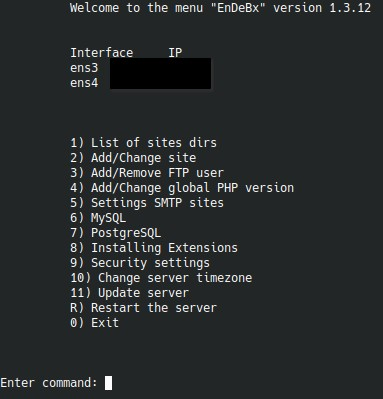

# EnDeBx

MkDocs + Material

# EnDeBx

Документация по EnDeBx — окружению и консольному меню для Debian-like дистрибутивов: Debian, Ubuntu и Astra Linux.

Проект повторяет привычный сценарий `bitrix-env`, но делает это через `bash`, `ansible` и `perl`, с упором на `php-fpm`, `mpm_event`, раздельных пользователей сайтов и расширяемое меню обслуживания.

[Установить окружение](getting-started/installation.md){ .md-button .md-button--primary }
[Все возможности](features.md){ .md-button }
[Открыть структуру меню](menu/index.md){ .md-button }

!!! warning "Перед использованием на production"
    Проект активно развивается. Перед внедрением на рабочих серверах лучше прогонять сценарии на тестовой копии и держать актуальные бэкапы.

{ .screenshot }

## Что умеет проект

-   :material-server-network: **Разворачивает окружение**

    Полная установка делает из чистой ОС готовый Bitrix-сервер с меню управления, `php-fpm`, `mpm_event`, раздельными пользователями сайтов, поддержкой `Brotli` и базовой конфигурацией сервисов.

-   :material-web: **Управляет сайтами**

    Меню умеет показывать список сайтов, создавать `full` и `link`, редактировать и удалять их, выпускать Let's Encrypt, включать redirect HTTP -> HTTPS, IP blocking, Basic Auth, Bot Blocker и NTLM.

-   :material-cog: **Настраивает runtime и доступы**

    Отдельные пункты отвечают за FTP-пользователей, глобальную и per-site PHP-конфигурацию, `xdebug`, SMTP для default и конкретных сайтов, а также системную таймзону.

-   :material-database-cog: **Работает с БД**

    Поддерживаются `MariaDB`/`Percona`, а также `PostgreSQL` с выбором источника пакетов, major-upgrade, регенерацией MySQL-конфига, выбором БД при создании сайта и опциональным `pgbouncer`.

-   :material-puzzle: **Подключает расширения**

    Через меню можно установить или удалить `Memcached`, `Push Server`, `Sphinx`, `File Conversion Server`, `Netdata`, `Docker`, `Snapd` и OS-specific репозитории для Ubuntu и Astra Linux.

-   :material-shield-check: **Защищает и обслуживает сервер**

    Есть блок `SSH/Updates`, отдельное управление `firewalld`, инструменты `CrowdSec`, `Rkhunter` и `Maldet`, системный `Update server`, reboot по `R`, уведомления о новых версиях меню и runbook-и для upgrade дистрибутивов.

## Полный каталог возможностей

На главной оставлен короткий обзор, а полный список возможностей вынесен на отдельную страницу [Возможности EnDeBx](features.md).

Там собраны и сгруппированы:

- возможности базового окружения;
- все пользовательские сценарии из меню сайтов;
- FTP, PHP, SMTP и runtime-настройки;
- MySQL, PostgreSQL и `pgbouncer`;
- дополнительные сервисы и системные переключатели;
- security-сценарии, обновление сервера, reboot и `update_menu`.

## Как читать документацию

Эта версия документации разложена по структуре реального меню:

- раздел **Возможности** дает полный каталог функций, сверенный с текущим меню;
- раздел **Начало работы** покрывает установку, обновление меню и устройство проекта;
- раздел **Главное меню** повторяет пункты верхнего уровня и вложенные подменю;
- раздел **Upgrade дистрибутивов** содержит пошаговые сценарии обновления ОС поверх уже установленного окружения.

## Быстрый старт

1. Подготовьте `/root/.env.menu` по примеру [.env.menu.example](configuration/env-file.md).
2. Запустите первичную установку из [раздела установки](getting-started/installation.md).
3. После установки используйте `/root/menu.sh` или запускайте меню автоматически по SSH.

## Полезные разделы

- Если нужна первичная установка, начните с [Установка окружения](getting-started/installation.md).
- Если нужен полный список функций, откройте [Возможности EnDeBx](features.md).
- Если обновилось меню, используйте [Обновление меню](getting-started/update-menu.md).
- Если нужно быстро понять навигацию, откройте [Обзор главного меню](menu/index.md).
- Если планируется upgrade ОС, переходите в [Upgrade дистрибутивов](upgrades/index.md).
