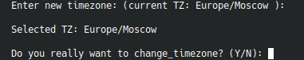

# 10. `Change server timezone`



Пункт меняет системную таймзону через отдельный playbook.

!!! warning "Внимание"
    Будут перезапущены сервисы, использующие системную таймзону, в том числе mysql и postgresql

## Что спрашивает меню

Нужно ввести новую таймзону. В prompt сразу показывается текущее значение.

Пример:

```text
Europe/Moscow
UTC
Asia/Yekaterinburg
```

## Что важно понимать

Изменение таймзоны влияет не только на shell-окружение. После применения таймзоны могут переинициализироваться или перечитать настройки связанные сервисы, включая БД и веб-стек.

## Когда это делать

- сразу после первичной установки;
- при переносе сервера в другой регион;
- если бизнес-логика Bitrix должна работать в другой timezone.
