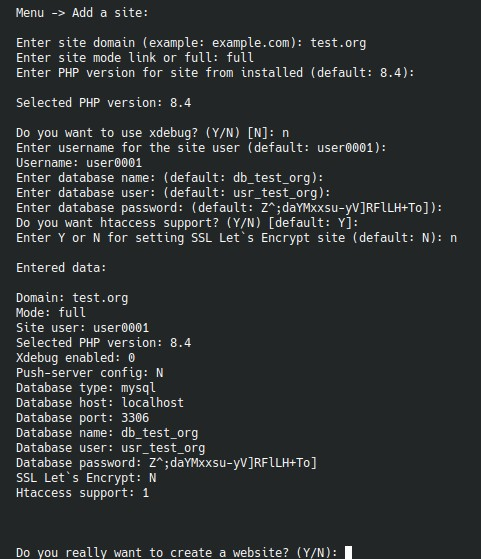

# `Add site`



Пункт создает новый сайт и в зависимости от режима ведет себя по-разному.

## Шаг 1. Домен и режим

Сначала меню просит:

- домен нового сайта;
- режим `link` или `full`.

Если каталог с таким доменом уже существует, меню не даст продолжить.

## Режим `link`

Для `link`-сайта сценарий проще:

- указывается путь к существующему `full`-сайту;
- автоматически определяется основное ядро;
- PHP-версия подхватывается из конфигурации связанного сайта;
- можно отдельно включить `xdebug` (`systemctl status php8.4-fpm-xdebug.service` — это xdebug версия. `systemctl status php8.4-fpm.service` — это обычная версия);
- затем отдельно выбираются `htaccess`, Let's Encrypt и редирект.

Симлинки создаются только для ресурсов из `BS_SITE_LINKS_RESOURCES`.

## Режим `full`

Для полноценного сайта меню дополнительно:

- проверяет наличие установленной БД;
- просит выбрать PHP-версию из [уже установленных](../4-php.md);
- предлагает включить `xdebug`;
- если push-server установлен, спрашивает, добавлять ли локальный push-конфиг в `bitrix/.settings.php`;
- генерирует системного пользователя для сайта и позволяет его переопределить;
- создает пользователя, если его еще нет в системе.

## Выбор базы данных

Если на сервере есть и MySQL, и PostgreSQL, меню предложит выбор:

```text
mysql | pgsql
```

Для PostgreSQL дополнительно:

- выбирается версия кластера, если их несколько;
- `db_host` переключается на `127.0.0.1`;
- порт может указывать на `pgbouncer`, если он установлен.

## Генерация имен БД и пользователя

Для `full`-сайта меню:

- генерирует `db_name` и `db_user` из домена;
- нормализует имена через helper;
- проверяет, не заняты ли такие имена;
- при конфликте пересобирает имена с добавлением случайного суффикса.

Пользователь все равно может вручную переопределить:

- имя БД;
- имя пользователя БД;
- пароль БД.

## Финальные опции

После базовых параметров меню спрашивает:

- включать ли поддержку `.htaccess`;
- выпускать ли Let's Encrypt сертификат;
- нужен ли сертификат для `www`;
- включать ли редирект HTTP -> HTTPS.

## Что создается в итоге

Для `full`-сайта сценарий обычно создает:

- системного пользователя;
- каталог сайта;
- БД и пользователя БД;
- конфиги Nginx и при необходимости Apache;
- интеграцию с push-server и/или `pgbouncer`, если они задействованы.

Для `link`-сайта создается облегченная обвязка вокруг существующего ядра.

!!! note "Если БД не установлена"
    При создании `full`-сайта меню остановится, если на сервере нет ни MySQL, ни PostgreSQL.
