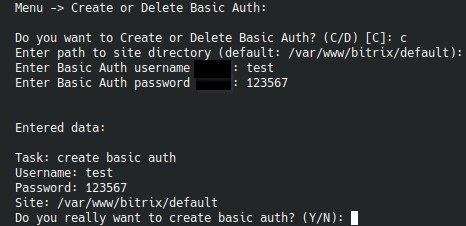

# `Enable/Disable Basic Auth in nginx`

Пункт создает или удаляет базовую HTTP-аутентификацию на уровне Nginx.

## Режимы работы

Доступны два действия:

- `create`
- `delete`

## Что спрашивает меню

Для создания:

- путь к каталогу сайта;
- логин;
- пароль.

Для удаления:

- путь к каталогу сайта.

Логин и пароль по умолчанию можно заранее задать переменными:

- `BS_NGINX_BASIC_AUTH_LOGIN`
- `BS_NGINX_BASIC_AUTH_PASSWORD`

## Какие файлы использует сценарий

Для каждого сайта задействуются:

- `.htpasswd` в `site_settings/<site>/`;
- `basic_auth.conf` в том же каталоге.

## Когда это удобно

Пункт полезен для:

- временного ограничения доступа на staging;
- защиты сайта перед миграцией;
- быстрого закрытия админских или тестовых зон на уровне фронта.
