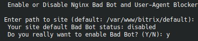

# `Enable/Disable Bot Blocker in nginx`



Этот пункт подключает или отключает per-site интеграцию с [`nginx-ultimate-bad-bot-blocker`](https://github.com/mitchellkrogza/nginx-ultimate-bad-bot-blocker).

Изучите документацию по [ссылке](https://github.com/mitchellkrogza/nginx-ultimate-bad-bot-blocker) для более тонкой настройки. Конфигурационные файлы в `/etc/nginx/bots.d/`.  

## Как определяется текущее состояние

Меню смотрит на наличие файла:

```text
<nginx bx>/site_settings/<site>/bots_block.conf
```

Если файл существует, считается, что блокировщик включен.

## Что спрашивает меню

Нужно указать путь к сайту, после чего меню:

- определяет домен по имени каталога;
- показывает текущее состояние;
- предлагает включить или выключить защиту.

## Когда использовать

Это полезный быстрый переключатель, если:

- нужно отсечь часть нежелательных user-agent;
- требуется быстро ужесточить фронтовую фильтрацию;
- вы хотите включать защиту не глобально, а только на отдельных сайтах.
