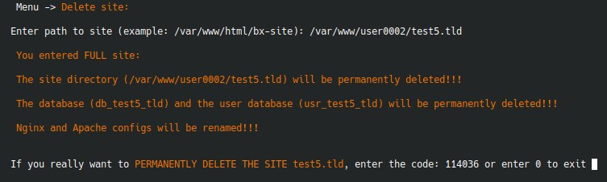

# `Delete site`

Удаление сайта - один из самых опасных сценариев в меню. Оно выполняется из подменю сайтов.

## Что делает меню перед удалением

Сначала нужно указать полный путь к каталогу сайта. Затем меню:

- определяет имя сайта по basename пути;
- понимает, это `full` или `link`-сайт;
- для `full`-сайта читает параметры БД из `bitrix/.settings.php`;
- для PostgreSQL дополнительно определяет версию и факт использования `pgbouncer`.

## Что будет удалено

Для `full`-сайта:

- каталог сайта;
- база данных;
- пользователь БД;
- конфиги Nginx и Apache будут переименованы или выключены playbook-ом.

Для `link`-сайта:

- каталог сайта;
- соответствующие веб-конфиги.

## Защита от случайного удаления

Перед подтверждением меню:

- показывает явные предупреждения;
- генерирует случайный шестизначный код;
- просит ввести его вручную;
- затем просит обычное подтверждение `Y/N`.

## Что проверить до удаления

- есть ли резервная копия файлов;
- не используют ли тот же `full`-сайт другие `link`-сайты;
- нужна ли отдельная ручная очистка внешних зависимостей.
