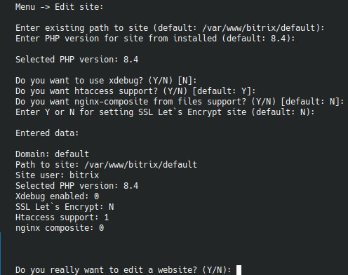

# `Edit existing website`



Пункт переиспользует существующий путь к сайту и позволяет обновить его рабочие параметры без полного пересоздания.

## Что спрашивает меню

Основные вопросы:

- путь к существующему сайту;
- PHP-версия из списка уже установленных;
- нужен ли `xdebug`;
- нужна ли поддержка `.htaccess`;
- нужно ли включить `nginx-composite from files`;
- перевыпускать ли или подключать Let's Encrypt;
- включать ли редирект HTTP -> HTTPS.

## Особенности Let's Encrypt

Если у сайта уже есть `ssl.conf` с сертификатом Let's Encrypt, меню пытается определить текущий домен сертификата автоматически.

Для сайта по умолчанию есть особое поведение:

- если редактируется каталог default-site;
- и домен сертификата неочевиден из имени каталога;
- меню отдельно запрашивает домен сертификата.

## Что именно меняется

Через этот пункт удобно:

- переключать сайт между версиями PHP;
- временно включать `xdebug`;
- добавлять Apache-обвязку для `.htaccess`;
- включать nginx-композит из файлового кэша;
- довыпускать сертификат и редирект после создания сайта.

## Когда лучше не использовать

Если вы хотите:

- поменять сам режим сайта `full`/`link`;
- заново создать БД;
- полностью снести и пересобрать сайт,

проще использовать удаление и повторное создание.

## Как изменить параметры в php

Файл `/etc/php/{php-версия}/fpm/conf.d/z_bx_custom.ini`.  
Стандартные параметры находятся в `/etc/php/{php-версия}/fpm/conf.d/bitrixenv.ini`.

## Параметры php-fpm

Файлы в `/etc/php/{php-версия}/fpm/pool.d/`, `*.conf` — для обычных, `.xdebug` — для использующих расширение xdebug.  
При редактировании сайта, они не затрагиваются.

## Как изменить опции в nginx

Структура конфигов, предназначенных для редактирования.
Имена директорий говорят сами за себя.
`section_http` конфиги подключаются в `http {}` в `nginx.conf`
`section_listen_http` — все http-сайты.
`section_listen_http_and_https/` — все сайты.
`section_listen_https` — все https-сайты.
`site_settings` — конфиги для отдельных сайтов, также доступны в `/etc/nginx/bx/site_settings` (симлинк).

```bash
/etc/nginx/custom_conf.d/
├──  section_http/
├──  section_listen_http/
├──  section_listen_http_and_https/
├──  section_listen_https/
└──  site_settings/
        └──  default/
           ├──  bx_temp.conf
           └──  ssl.conf
```
