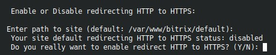

# `Enable/Disable redirect HTTP to HTTPS`

Пункт находится внутри подменю `Add/Change site` и включает или выключает редирект на уровне конкретного сайта.

## Как работает выбор

Меню просит путь к сайту, затем:

- извлекает имя сайта из basename;
- сверяет его со списком найденных сайтов;
- по внутренним данным определяет, включен редирект или нет (наличие файла `.htsecure` в корне выбранного сайта);
- предлагает выполнить противоположное действие.

## Когда использовать

Это отдельный быстрый переключатель, если:

- сертификат уже есть;
- нужно временно отключить редирект;
- вы хотите разделить выпуск сертификата и включение redirect на два шага.

## Что полезно проверить заранее

- у сайта действительно есть валидный SSL-конфиг;
- вы меняете именно тот путь, который ожидаете;
- нет внешней логики, завязанной на HTTP.
