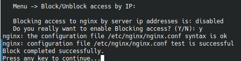

# `Block/Unblock access by IP`



Этот пункт управляет отдельным Nginx-конфигом `bx_ext_ip.conf`, который блокирует обращения к серверу по его IP-адресу.

## Что происходит при включении

Меню:

- определяет текущий IP сервера;
- создает виртуальный хост, слушающий `80` и `443`;
- для HTTPS использует `ssl_reject_handshake on`;
- для обычных запросов возвращает `444`;
- включает конфиг (`/etc/nginx/bx/site_enabled/bx_ext_ip.conf`) и перезагружает Nginx после проверки синтаксиса.

## Когда это полезно

Пункт нужен, если вы не хотите, чтобы по адресу вида:

```text
http://IP_сервера
```

открывался сайт по умолчанию.

## Что не делает этот сценарий

Он не меняет доступ по доменным именам и не затрагивает сами сайты. Меняется только поведение при прямом обращении по IP.
