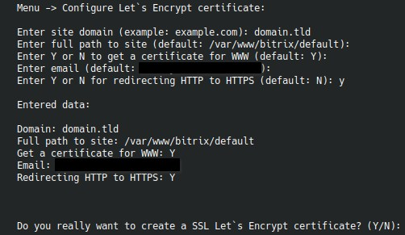

# `Configure Let's Encrypt certificate`

Это отдельный сценарий выпуска сертификата внутри подменю `Add/Change site`, без захода в полное редактирование сайта.

## Что спрашивает меню

- домен сертификата;
- полный путь к сайту;
- нужен ли сертификат для `www`;
- email для уведомлений;
- включать ли редирект HTTP -> HTTPS.

## Значения по умолчанию

По умолчанию меню:

- использует путь к основному сайту;
- включает сертификат для `www`;
- берет email из `BS_EMAIL_ADMIN_FOR_NOTIFY`, а если он пустой - генерирует `admin@domain`.
- конфигурационный файл в `/etc/nginx/bx/site_settings/домен/ssl.conf`

## Когда использовать этот пункт

Пункт удобен, если:

- сайт уже создан и нужно только довыпустить сертификат;
- не хочется идти в полное редактирование сайта;
- нужно быстро повторить выпуск после переезда домена.

## Что меняется дополнительно

При желании в этом же сценарии можно сразу включить редирект HTTP -> HTTPS.
