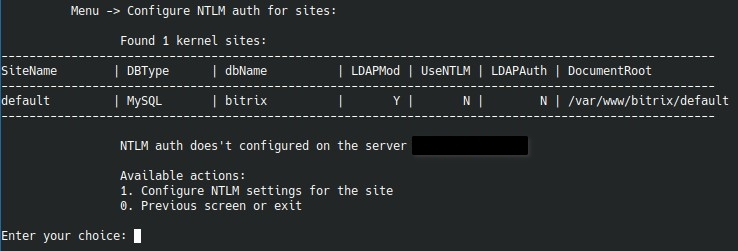

# `Configure NTLM auth for sites`

Этот пункт меню настраивает NTLM-авторизацию через отдельные Apache vhost на портах `8890/8891`.

!!! warning "До запуска данного меню"
    Обязательно предварительно выполните пункты `1-3` из документации Bitrix: [Настройка NTLM модуля Linux для Битрикс](https://dev.1c-bitrix.ru/learning/course/index.php?COURSE_ID=41&LESSON_ID=5078&LESSON_PATH=3911.27946.5076.5078). Данное меню закрывает пункт `4`.

## Что умеет раздел

Внутри доступны действия:

- настроить NTLM для сайта;
- использовать уже существующие серверные настройки для другого сайта;
- удалить NTLM-настройки.

## Что показывает меню перед настройкой

Перед вопросами меню собирает служебную картину:

- список kernel-сайтов на сервере;
- тип и имя БД каждого сайта;
- признаки включенного LDAP/NTLM в Bitrix;
- текущее состояние присоединения сервера к домену.

## Какие данные нужны для первоначальной настройки

Если сервер еще не настроен, меню спросит:

- NetBIOS hostname;
- NetBIOS domain/workgroup;
- FQDN домена;
- адрес domain controller / password server;
- доменного администратора;
- пароль доменного администратора.

После этого отдельно выбирается сайт и параметры SSL.

## Поведение для сайта

После выбора сайта меню:

- определяет домен и путь;
- подхватывает PHP-версию из текущего Apache-конфига;
- определяет, включен ли уже Let's Encrypt;
- при необходимости предлагает перевыпустить сертификат под отдельный NTLM-vhost.

## Сценарий `Use existing NTLM settings`

Если сервер уже присоединен к домену, можно не вводить доменные параметры повторно. Этот режим просто применяет существующую серверную конфигурацию к новому сайту.

## Сценарий удаления

Удаление NTLM-настроек тоже требует доменные реквизиты и подтверждение. Это сделано для осознанного демонтажа связки.

## Практические замечания

Перед использованием этого пункта обычно стоит:

- убедиться, что сервер видит внутренний DNS AD. Это может быть контроллер домена или отдельный внутренний DNS-сервер.
- синхронизация времени должна идти с вашим офисным источником времени, например с контроллером домена. Один из вариантов для `chrony`: указать в конфиге `server ip_ntp_сервера iburst`, затем выполнить `systemctl restart chrony`.
- проверить синхронизацию можно командами `chronyc sources` и `chronyc tracking`.
- для принудительной синхронизации можно использовать `ntpdate ip_ntp_сервера`. В качестве NTP-сервера также может выступать контроллер AD.
- при включении NTLM меню использует опцию Bitrix `ldap:bitrixvm_auth_net` для ограничения адресов, откуда разрешена автоматическая авторизация. Если `bitrixvm_auth_net` уже заполнена, используется её текущее значение. Если она пуста, меню пытается автоматически подставить локальную подсеть сервера по маршруту к контроллеру домена или LDAP-серверу. Опция `ldap:bitrixvm_auth_support` включается только если итоговая сеть определена и не пуста.
- для прозрачной авторизации дополнительно проверьте настройки браузеров сотрудников. Например, для Firefox нужно добавить сервер в `network.automatic-ntlm-auth.trusted-uris`, а для Internet Explorer/Edge сервер должен находиться в зоне `Local Intranet`. Подробности: [Настройка браузеров сотрудников](https://dev.1c-bitrix.ru/learning/course/index.php?COURSE_ID=41&LESSON_ID=5077).

!!! warning "Сценарий затрагивает не только веб-конфиги"
    NTLM-настройка работает на стыке Apache, Samba/winbind, Bitrix LDAP-модуля и SSL. На production лучше сначала проверять на отдельном тестовом сайте.
