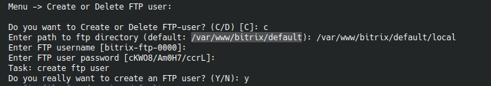

# 3. `Add/Remove FTP user`

Пункт управляет FTP-пользователями через `pure-ftpd`.

## Режимы работы

Используется [pureftpd](https://www.pureftpd.org). Конфигурационные файлы в `/etc/pure-ftpd/`  
Доступны два действия:

- `create`
- `delete`

## Создание пользователя

При создании меню:

- спрашивает путь к FTP-каталогу;
- генерирует уникальное имя вида `<default-user>-ftp-0000`;
- разрешает переопределить имя вручную;
- генерирует случайный пароль и тоже позволяет заменить его;
- перед подтверждением показывает итоговые данные.

## Удаление пользователя

При удалении меню:

- показывает список существующих FTP-пользователей;
- просит выбрать пользователя по номеру;
- требует отдельное подтверждение.

## Когда это удобно

Пункт полезен, если:

- разработчику или подрядчику нужен доступ только к одному каталогу;
- не хочется выдавать SSH;
- нужно быстро отозвать доступ после завершения работ.
