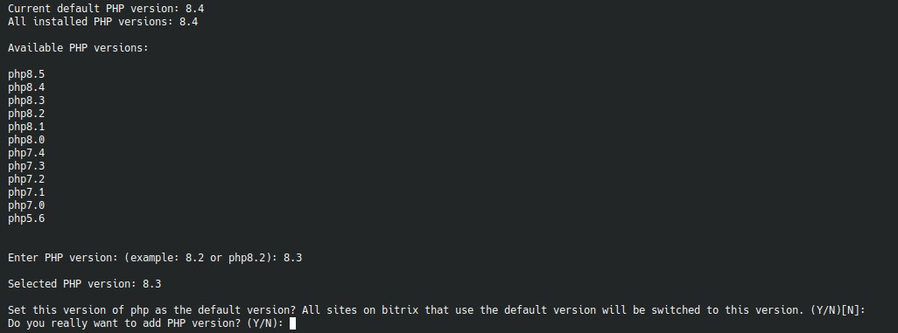

# 4. `Add/Change global PHP version`

Пункт устанавливает новую глобальную версию PHP и при желании делает ее версией по умолчанию.



## Что спрашивает меню

- номер PHP-версии;
- делать ли ее default-версией для сайтов, которые используют системную версию по умолчанию.

Допустимы формы ввода вроде:

```text
8.4
php8.4
```

## Что происходит дальше

Сценарий запускает отдельный playbook установки PHP-пакетов и передает в него:

- новую версию;
- текущую default-версию;
- флаг, нужно ли переключить сайты на новый default;
- дополнительные PHP-расширения из `BX_ADDITIONAL_PHP_EXTENSIONS`.

## Когда использовать

Пункт нужен для:

- установки новой ветки PHP перед миграцией сайтов;
- перевода всех сайтов с default-поведения на новую версию;
- подготовки среды к выбору новой PHP-версии в `Add site` и `Edit existing website`.

## Что не меняет этот пункт

Он не перенастраивает вручную каждый сайт по отдельности. Отдельные сайты можно переключать через редактирование их конфигурации.

## Как изменить параметры в php

Файл `/etc/php/{php-версия}/fpm/conf.d/z_bx_custom.ini`.  
Стандартные параметры находятся в `/etc/php/{php-версия}/fpm/conf.d/bitrixenv.ini`.

## Параметры php-fpm

Файлы в `/etc/php/{php-версия}/fpm/pool.d/`, `*.conf` — для обычных, `.xdebug` — для использующих расширение xdebug.  
При редактировании сайта, они не затрагиваются.
