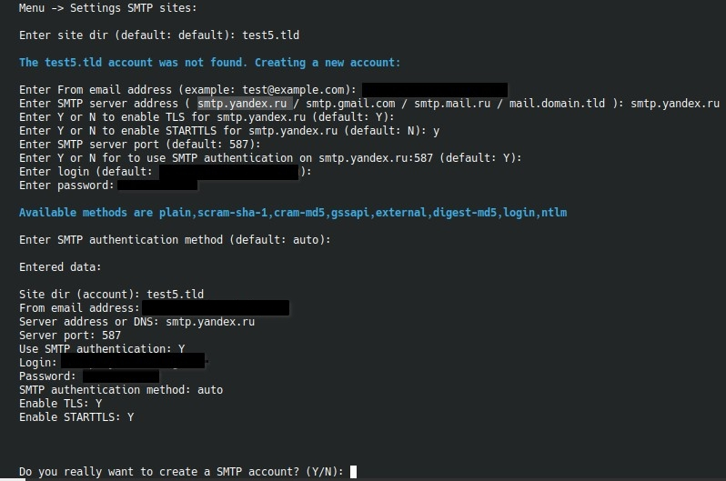

# 5. `Settings SMTP sites`

Пункт настраивает SMTP-аккаунт для конкретного сайта или для default-аккаунта.



!!! warning "Пароль для приложения"
    На большинстве сервисов нужно создать специальный пароль для приложения:  
    - [yandex](https://yandex.ru/support/id/ru/authorization/app-passwords)  
    - [mail.ru](https://help.mail.ru/mail/security/protection/external/)  
    - [gmail](https://support.google.com/accounts/answer/185833?hl=ru)  

## Как работает сценарий

Перед вводом меню пытается прочитать существующий аккаунт из общего SMTP-конфига. Если аккаунт найден, его настройки показываются на экране, а действие трактуется как `update`.

## Что спрашивает меню

- каталог сайта;
- `From` email;
- SMTP host;
- включать ли TLS;
- включать ли STARTTLS, если включён TLS;
- SMTP port;
- использовать ли SMTP authentication;
- логин и пароль;
- метод аутентификации;
- итоговое подтверждение с выбранными параметрами.

По умолчанию меню подставляет порт по выбранному режиму:

- `TLS=off` -> `25`;
- `TLS=on`, `STARTTLS=off` -> `465`;
- `TLS=on`, `STARTTLS=on` -> `587`.

## Особенность default-сайта

Если выбран сайт по умолчанию, внутренняя запись будет называться `default`.

## Где лежит конфигурация

Сценарий работает с файлом:

```text
/etc/msmtprc
```

и использует wrapper:

```text
/usr/local/bin/msmtp_wrapper.sh
```

## Когда это полезно

Пункт нужен, если:

- нужно задать глобальную почту для сервера;
- у отдельного сайта своя SMTP-учетка;
- требуется перевести проект на другой почтовый провайдер без ручного редактирования конфигов.
- по умолчанию на сервер устанавливается postfix. Отправка почты идёт прямо с сервера без аккаунта.  Если сервер за анти-ддос панелью, то такая отправка приводит к утечке ip-адреса сервера. Поэтому, для отправки почты нужно настроить использование стороннего smtp-сервера.
- первый созданный аккаунт станет аккаунтом по умолчанию. Все сайты на сервере будут использовать его. Если хотите, чтобы какие-то сайты продолжали использовать локальный `postfix` просто добавьте для них аккаунт с ip 127.0.0.1 и портом 25.
- если сервер не за анти-ддосом, то лучше использовать локальный `postfix`, так как большинство почтовых сервисов имеют лимиты на отправку почты. Типичный интернет-магазин вполне легко может превысить эти лимиты при большом количестве заказов.  
Если грамотно настроить dns-записи (spf / rDNS), то письма будут доходить до получателей не попадая в спам. Убедитесь только, что ip-сервера нет в чёрных списках.
- для проверки настроек можно использовать [сервис](https://www.mail-tester.com/).
- также можно использовать собственный почтовый сервер, например [mailcow](https://mailcow.email/), [mailu](https://mailu.io/).
