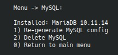

# 6. `MySQL`

Пункт `MySQL` теперь доступен прямо в главном меню. Внутреннее подменю ведет себя динамически: состав пунктов зависит от того, установлен сервер или нет.

## Если MySQL еще не установлен

Меню покажет `Install MySQL` и спросит:

- flavor: `percona` или `mariadb`;
- версию Percona: `5.7`, `8.0` или `8.4`;
- `BS_DB_CHARACTER_SET_SERVER`;
- `BS_DB_COLLATION`.

Для `MariaDB` используется версия из репозитория дистрибутива

## Ограничения по версиям

Меню валидирует недоступные сочетания:

- на Debian 13 нельзя выбрать `Percona 5.7` и `Percona 8.0`;
- на Ubuntu 24.04+ нельзя выбрать `Percona 5.7`.

## Если MySQL уже установлен

Меню показывает:

- текущий flavor (percona/mariadb);
- текущую версию;
- повторную генерацию конфига;
- при необходимости upgrade-цепочку;
- удаление MySQL.

## `Re-generate MySQL config`

Переиспользует текущие значения `character_set` и `collation`, чтобы заново сгенерировать конфигурацию.

## `Upgrade percona 5.7 to 8.0`

## `Upgrade percona 8.0 to 8.4`

Оба сценария требуют осознанного подтверждения и предполагают, что у вас уже есть полноценный бэкап БД.

## `Delete MySQL`

Пункт явно предупреждает, что будут удалены:

- все базы данных;
- все пользователи;
- каталоги данных.

Это полное удаление MySQL/MariaDB из окружения.

## Как изменить опции mysql

- для mariadb — `/etc/mysql/mariadb.conf.d/z_bx_custom.cnf`
- для percona — `/etc/mysql/mysql.conf.d/z_bx_custom.cnf`
