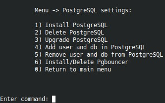

# 7. `PostgreSQL`

Пункт `PostgreSQL` теперь доступен прямо в главном меню. Внутри подменю доступны все базовые операции жизненного цикла: установка, удаление, major-upgrade, создание БД и работа с `pgbouncer`.

## `Install PostgreSQL`

Меню показывает уже установленные версии и затем спрашивает:

- источник пакетов: `official` или `distro`;
- целевую версию;
- порт для нового кластера.

Если выбран `distro`, версия определяется автоматически из APT-кэша дистрибутива.

## `Delete PostgreSQL`

Для удаления нужно явно указать версию кластера. Меню отдельно предупреждает, что будут удалены:

- все БД выбранной версии;
- пользователи;
- сами данные кластера.

## `Upgrade PostgreSQL`

Сценарий major-upgrade:

- показывает установленные кластеры и их порты;
- просит выбрать версию `from`;
- просит выбрать источник пакетов и версию `to`;
- не позволяет понижать версию;
- не позволяет продолжить, если target-cluster уже существует.

Playbook переносит данные в новый major-релиз, сохраняет исходный порт и после успешного upgrade удаляет старую версию.

## `Add user and db in PostgreSQL`

Меню спрашивает:

- версию PostgreSQL;
- имя пользователя;
- пароль;
- имя БД;
- `LC_COLLATE`;
- `LC_CTYPE`;
- `encoding`.

Если `pgbouncer` уже установлен, после создания пользователя меню дополнительно добавляет его в конфиг `pgbouncer`.

## `Remove user and db from PostgreSQL`

Для удаления нужно указать:

- версию PostgreSQL;
- имя пользователя;
- имя БД.

Если `pgbouncer` установлен, пользователь также удаляется из его конфигурации.

## `Install/Delete Pgbouncer`

Пункт переключает пакет и конфигурацию `pgbouncer`. После установки он может использоваться при создании PostgreSQL-сайтов и для ручного добавления пользователей.
