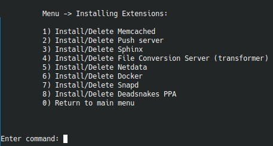

# Сервисы и утилиты



Эта страница покрывает пункты расширений, которые не требуют отдельного дерева сценариев.

## `Install/Delete Memcached`

Меню определяет наличие `memcached` по бинарнику и переключает состояние. После установки основной конфиг находится в:

```text
/etc/memcached.conf
```

Сокет в `/tmp/memcached.sock`

## `Install/Delete Push server`

Конфиг в `/etc/default/push-server-multi`  
Получить "Код-подпись для взаимодействия с сервером:" `grep SECURITY_KEY= /etc/default/push-server-multi`  
Если push-server уже найден по одному из служебных файлов, меню предлагает удаление. При удалении дополнительно спрашивается:

- удалять ли `Redis` вместе с push-server.

Это удобно, если Redis используется еще кем-то кроме push-сервера.

## `Install/Delete Sphinx`

Состояние определяется по пакету `sphinxsearch`. Пункт просто устанавливает или удаляет полнотекстовый поиск.

## `Install/Delete File Conversion Server (transformer)`

При установке нужно указать:

- домен сайта;
- полный путь к сайту.

Пункт ориентирован на Bitrix-сценарий локального file conversion server и требует привязки к конкретному сайту. Только для лицензии Энтерпрайз. Меню самостоятельно произведёт все настройки битрикса для использования локального модуля.

## `Install/Delete Netdata`

Установка системы мониторинга [Netdata](https://www.netdata.cloud/)

- генерирует логин и пароль;
- создает htpasswd-файл для;
- после завершения показывает URL и выданные учетные данные.

## `Install/Delete Docker`

Установка свежей версии докера из официальных репозиториев. Роль меняет `log-driver` в `/etc/docker/daemon.json` c `json` на `local`, так как `json` очень сильно забивает место на диске.  
После установки в Docker-группу добавляются все локальные пользователи с UID `1000` и выше.
