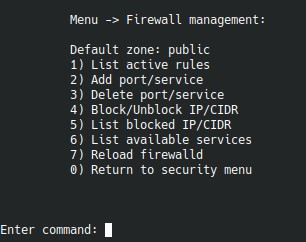

# `Firewall management`

Подменю `Firewall management` управляет правилами `firewalld` без ручного редактирования командной строки.

Сценарий использует уже существующий playbook `vm_menu/ansible/playbooks/firewall.yaml` и применяет правила в `firewalld` через Ansible.

## Что входит в раздел

- `List active rules` - показать активные зоны и текущие правила `firewalld`.
- `Add port/service` - открыть порт вида `80/tcp` или включить именованный сервис, например `http` или `https`.
- `Delete port/service` - удалить ранее добавленный порт или сервис из нужной зоны.
- `Block/Unblock IP/CIDR` - добавить или убрать источник из зоны `drop`.
- `List blocked IP/CIDR` - показать список источников, заблокированных через `drop`.
- `List available services` - вывести список сервисов, известных `firewalld`.
- `Reload firewalld` - выполнить `complete-reload`.

## Как это работает

- для портов и сервисов по умолчанию используется текущая default-zone `firewalld`;
- блокировки из этого меню добавляются в зону `drop`;
- правила создаются как persistent, поэтому переживают перезагрузку сервера.

## Примеры

- открыть `8080/tcp` во `firewalld` для временного сервиса;
- разрешить сервис `postgresql` в отдельной зоне;
- быстро заблокировать подсеть `203.0.113.0/24` в `drop`.

## Когда использовать

- если нужно точечно открыть или закрыть сетевой доступ без полного re-run установки;
- если требуется быстро заблокировать IP/CIDR до подключения более сложных инструментов вроде `CrowdSec`;
- если вы сопровождаете сервер вручную и хотите держать базовые сетевые правила в одном меню.
