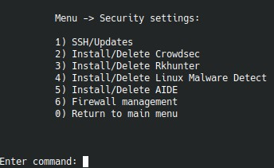

# 9. `Security settings`

Подменю безопасности отвечает за SSH-политику и за установку базовых защитных инструментов.

## Что входит в раздел

- `SSH/Updates`
- `Install/Delete Crowdsec`
- `Install/Delete Rkhunter`
- `Install/Delete Linux Malware Detect`
- `Install/Delete AIDE`
- `Firewall management`

## Общая рекомендация

Перед применением security-настроек лучше заранее проверить:

- что у вас есть доступ к root-консоли или out-of-band доступ;
- что новый SSH-порт не занят;
- что у альтернативного sudo-пользователя корректный ключ и пароль;
- что изменения в `firewalld` не закроют ваш текущий доступ к серверу.
