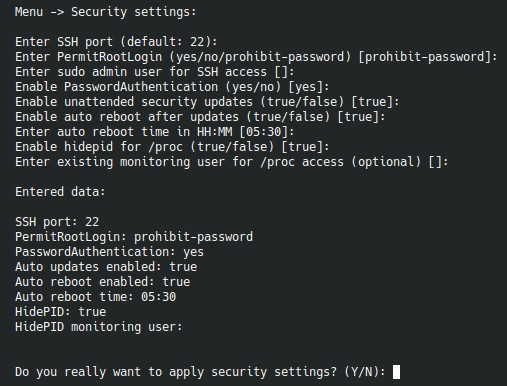

# `SSH/Updates`

Это сценарий повторного применения security-параметров без полной переустановки окружения.

## Что спрашивает меню

- SSH port;
- `PermitRootLogin (yes/no/prohibit-password)` — значение `PermitRootLogin` для `sshd_config`;
- альтернативный sudo-пользователь;
- `passwordless sudo` — если выбрать `true`, пользователь будет добавлен в `sudoers` без запроса пароля. Если выбрать `false`, sudo будет запрашивать пароль пользователя;
- пароль для sudo-пользователя, если нужен;
- `PasswordAuthentication` — включение или отключение входа по паролю;
- включать ли unattended security updates — автоустановка обновлений безопасности;
- включать ли autoreboot после обновлений;
- время autoreboot;
- включать ли `hidepid=2` для `/proc`;
- опциональный пользователь, которого нужно добавить в группу `procmon`, чтобы сохранить ему доступ к `/proc` (например `zabbix`). Если поле оставить пустым, все текущие участники группы `procmon` будут удалены из неё;

## Что валидируется

Меню не просто собирает строки, а проверяет:

- что SSH-порт находится в диапазоне `1..65535`;
- что новый порт не занят другим сервисом;
- что `PermitRootLogin` имеет допустимое значение;
- что время autoreboot указано в формате `HH:MM`;
- что пользователь мониторинга действительно существует.

## Дополнительная защита

Если выбран `PermitRootLogin=no`, но не указан альтернативный админ-пользователь, сценарий не позволит применить изменения.

## Что уходит в playbook

В playbook передаются все основные параметры SSH, sudo, unattended updates и `hidepid`, а также email администратора для уведомлений security-обновлений.

## Когда этот пункт особенно полезен

- сразу после первичной установки;
- при переносе сервера в более строгий security-профиль;
- когда нужно включить автообновления без полного rerun установки.
